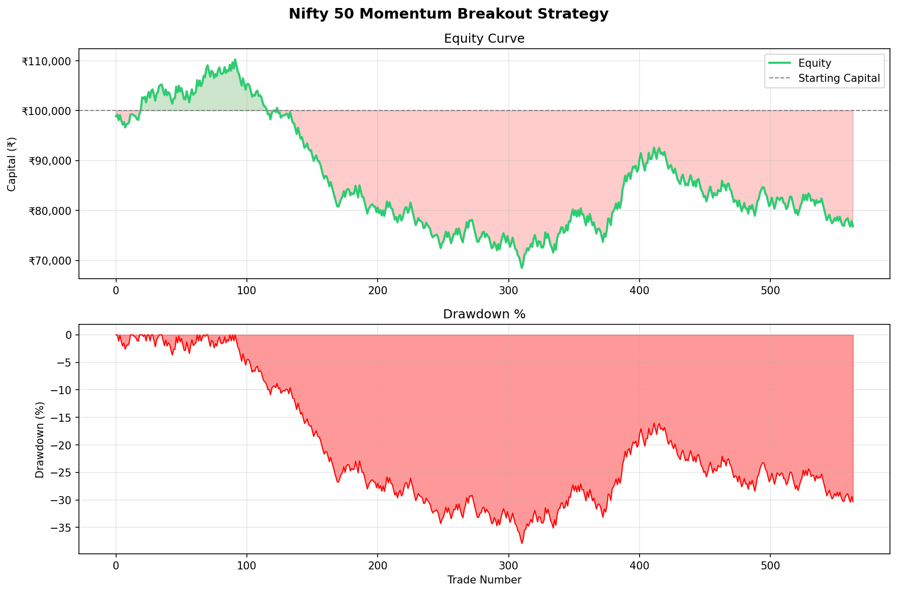

# 10 EMA Reversion Strategy — Nifty 50 Intraday

A complete quantitative trading system built from scratch in Python. This project documents the full research process — from hypothesis to backtesting to honest analysis of results — including real transaction costs, market regime filtering, and partial exit management.

---

## Strategy Hypothesis

> *On days where the first hourly candle is large and directional, price tends to revert to the 10 EMA before continuing in the direction of the opening impulse. This reversion point offers a high-probability entry with defined risk.*

**Inspired by:** Manual trading observations on NSE intraday charts (TradingView, 15-min timeframe)

---

## Strategy Rules

### Entry Conditions
| Condition | Rule |
|---|---|
| First candle size | Range > 1% of open price |
| Bullish day | First candle GREEN + Close above 10 EMA → look for LONG |
| Bearish day | First candle RED + Close below 10 EMA → look for SHORT |
| EMA touch | Price pulls back to touch 10 EMA within first 3 hours |
| Regime filter | Nifty index must be above its 20-day EMA (bull market only for longs, bear market only for shorts) |
| Time window | Entries only between 9:15 AM – 12:00 PM IST |

### Exit Conditions
| Exit | Rule |
|---|---|
| Stop Loss | 0.6% from entry price |
| Take Profit 1 (TP1) | 0.9% from entry — exit 50% of position |
| Take Profit 2 (TP2) | 2.5% from entry — exit remaining 50% |
| Time Exit | Force close at 3:00 PM IST — no overnight holds |

### Position Sizing
Risk 1% of capital per trade:
```
Position Size = (Capital × 1%) / (Entry Price − Stop Loss Price)
```

---

## Transaction Costs Modeled

| Cost | Value |
|---|---|
| Brokerage | ₹20 per order (₹40 per trade) |
| STT | 0.0025% on sell turnover |
| Slippage | 0.05% per side |

---

## Results (1 Year — April 2025 to April 2026)

| Metric | Value |
|---|---|
| Initial Capital | ₹1,00,000 |
| Final Capital | ₹76,832 |
| Total Return | -23.17% |
| Total Trades | 564 |
| Win Rate | 46.6% |
| Avg Win | ₹890 |
| Avg Loss | ₹854 |
| Risk-Reward | 1:1.04 |
| Profit Factor | 0.91 |
| Sharpe Ratio | -0.66 |
| Max Drawdown | -37.91% |

### Equity Curve



---

## Research Journey — Version History

This project documents the full iterative research process, not just the final result.

### V1 — Breakout Strategy (No Costs)
**Hypothesis:** Stocks breaking above 20-candle high with volume confirmation continue upward.
**Result:** -28% return. Win rate only 19.7% — too many false breakouts in a downtrending market.
**Learning:** A 1:2 RR strategy needs >33% win rate to be profitable. This one didn't clear the bar.

### V2 — EMA Reversion (No Costs)
**Hypothesis:** Switch to mean reversion — trade pullbacks to 10 EMA after strong opening candles.
**Result:** +90% return on paper. Equity curve consistently trending upward.
**Learning:** The strategy has genuine alpha. Win rate ~50%, good RR structure.

### V3 — EMA Reversion (With Real Costs)
**Same strategy, but with ₹40 brokerage + STT + slippage modeled.**
**Result:** -30% return. The 90% gain evaporated entirely.
**Learning:** Transaction costs are not a footnote — they are the strategy. Small winners (~₹200-400) don't survive ₹100-150 in costs per trade.

### V4 — Regime Filter Added
**Added Nifty 20-day EMA regime filter — only trade long in bull markets, short in bear markets.**
**Result:** -23% on 1 year of data. Profit factor improved to 0.91.
**Learning:** Regime filtering helps significantly. The strategy is near-breakeven without the cost drag. Jan–Mar 2026 (a severe Nifty correction) accounts for the bulk of losses.

---

## Why The Strategy Doesn't Fully Work (Yet)

### The Core Problem: Cost-to-Win Ratio

```
351 TIME EXIT trades  →  avg gross ~₹250  →  after costs ~₹100 net
198 STOP LOSS trades  →  avg loss  ~₹854
```

The winners are too small relative to costs. This is a **market microstructure problem**, not a signal quality problem.

### Evidence That The Signal Is Real
- Win rate of 46.6% is above the 33% breakeven threshold for 1:1 RR
- TP2 hits (full 2.5% target) averaged +₹2,400 — excellent trades
- February 2026 (ranging market) was nearly breakeven — strategy works in its intended regime
- Manual trading of the same setup (TradingView paper trades) showed RR of 5.74 on individual trades

### What Would Make It Profitable

**Option 1 — Trade Futures Instead of Equity**
- STT on futures = 0.0125% vs 0.025% on equity intraday
- 1 Nifty lot = ₹6 lakh+ exposure → same signal, 10x better cost ratio

**Option 2 — Increase Target Size**
- Move TP2 from 2.5% to 4-5%
- Fewer trades, bigger wins, costs become negligible percentage of profit

**Option 3 — Filter for High-Volatility Days Only**
- Only trade when VIX > 15 or ATR > 1.5% daily range
- Larger intraday moves = larger wins = costs absorbed more easily

---

## Project Structure

```
strategy/
│
├── data/
│   ├── fetch_data.py          # Downloads 1-year hourly OHLCV data for 20 Nifty 50 stocks
│   └── *.csv                  # Historical data files
│
├── strategy/
│   └── signals.py             # Entry/exit signal generation + regime filter
│
├── backtest/
│   ├── engine.py              # Trade simulation with partial exits + real costs
│   └── metrics.py             # Performance metrics + equity curve visualization
│
├── results/
│   ├── trades.csv             # Full trade log (564 trades)
│   └── equity_curve.png       # Equity curve + drawdown chart
│
└── README.md
```

---

## How To Run

**1. Install dependencies**
```bash
python -m venv venv
venv\Scripts\activate        # Windows
pip install yfinance pandas numpy matplotlib seaborn
```

**2. Download data**
```bash
python data/fetch_data.py
```

**3. Run backtest**
```bash
python backtest/engine.py
```

**4. View performance metrics**
```bash
python backtest/metrics.py
```

---

## Skills Demonstrated

- **Python** — pandas, numpy, matplotlib, yfinance
- **Quantitative Finance** — backtesting, position sizing, risk-reward analysis, drawdown calculation
- **Market Microstructure** — slippage modeling, transaction cost analysis, STT impact
- **Strategy Research** — hypothesis formation, iterative testing, regime analysis
- **Software Engineering** — modular architecture, reusable components, clean code

---

## Author

**Parth Sarthi Saxena**
B.Tech ECE, JECRC Foundation, Jaipur (2027)
📧 parthsarthisaxena95@gmail.com
🐙 github.com/parthsarthisaxena

*Independent quantitative researcher with 400+ live trades across systematic strategies.*

---

## Disclaimer

This project is for educational and research purposes only. Past backtest results do not guarantee future performance. This is not financial advice.
